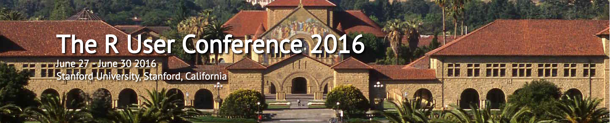

These are my notes from the wonderful [useR 2016](user2016.org) conference at Stanford. These were notes I made rather hastily before and during the conference, so it's not meant to be an exhaustive review of the conference, and is likely to have many errors. 

You're probably better off looking at the notes compiled by the wonderful [Jasmine Dumas](https://github.com/jasdumas/user2016-notes)!

The video lectures [can be found here on Channel9](https://channel9.msdn.com/Events/useR-international-R-User-conference/useR2016)

The full [abstract book can be found here](http://user2016.org/files/abs-book.pdf)

Slides are being noted and compiled on the [RWeekly newsletter](https://github.com/rweekly/rweekly.org/blob/gh-pages/_posts/2016-7-3-user2016.md)

# Monday Tutorials (June 27)

Links to prereq material for tutorials and some notes for the the ones I attended.

Super bummed out that these weren't recorded.

## Morning Tutorials: 9:00am - 12:00pm

##### Erin LeDell - H2O.ai: Machine Learning Algorithmic Deep Dive

This is the only tutorial I attended in the morning, and I'm very glad I dedicated the entire morning here. Erin did an incredible job of covering the algorithms and provided useful examples for each, compiling the existing software frameworks for using each, and provided some historical context for their development, satisfying the story hungry geeks in the audience (I'm a sucker for stories and anecdotes).

+ [Syllabus](http://user2016.org/tutorials/10.html)
+ [Tutorial Repo](https://github.com/ledell/useR-machine-learning-tutorial)
+ In depth tutorial on six supervised ML models
+ Erin's background is in statistics, and she has written packages for stacking - learning ensembles
+ The notebooks were originally provided in the form of Jupyter notebooks. Since most of the participants have not used Jupyter/IPython notebooks, [Ramnath coverted](https://github.com/ledell/useR-machine-learning-tutorial/commit/f44f26dabac32096ec1178e4ff65b072ba76cde0) (using notedown) the ipynbs to Rmds for the class!

1. [Decision Trees](https://github.com/akzaidi/useR-machine-learning-tutorial/blob/master/decision-trees.ipynb)
	* Although piecewise smooth boundaries, decision trees can eventually learn smoother boundaries
	* It should have already gone viral, but the [incredible work by Stephanie and Tony on visualizing decision trees should absolutely not be missed](http://www.r2d3.us/visual-intro-to-machine-learning-part-1/)
		- moral of the story: designers and data scientists make for a great couple!
2. [Random Forests](https://github.com/ledell/useR-machine-learning-tutorial/blob/master/random-forest.ipynb)
	* Preceded by the [random subspace method/attribute bagging](https://en.wikipedia.org/wiki/Random_subspace_method)
		- this gets you half of the random magic of RFs.
		- the other half is from model averaging, aka bagging.
		- reduces the noise/variability of the individual predictors, turning piecewise linear predictors into smoother function approximators.
		- taking the two together, we improve the bias of a single DTree, and reduce the variability of the individual trees in the forest.
	* aside from the well known frameworks in R, h20 provides an Apache 2.0 licensed set of functions for random forests that are:
		- written in a Java backend
		- easily distributable and parallelizable
		- provide grid search for hyperparameter and model selection
		- worth comparing to rxDForest in the `RevoScaleR` package
	* [extremely randomized trees](http://link.springer.com/article/10.1007%2Fs10994-006-6226-1)
		- randomize features and split points
		- in h20 with `histogram_type = 'Random'`
		- also a `extraTrees` package
	* gilles loupe (scikit-learn developer) has a paper on [ranking with extremely randomized trees](http://hdl.handle.net/2268/84538)  
		- [link to paper](http://jmlr.csail.mit.edu/proceedings/papers/v14/geurts11a/geurts11a.pdf)
		- https://glouppe.github.io/
	* [parallel random forests HP open source library](https://github.com/vertica/vertica.github.io)
3. [Gradient Boosting Machines](https://github.com/ledell/useR-machine-learning-tutorial/blob/master/gradient-boosting-machines.ipynb)
	> Can we make dumb learners smart?
	* Started with cool ideas from Robert Schapire and Yoav Freund, where weak learners are improved by giving them prominence where they succeed.
	* in gradient boosting, weak learners are strengthened by iteratively choosing a weak hypothesis that points in the negative gradient.
	* if you haven't checked out [xgboost](https://github.com/dmlc/xgboost), give it a go now!
4. [glms and penalized regressions](https://github.com/akzaidi/useR-machine-learning-tutorial/blob/master/generalized-linear-models.ipynb)
	* rob tibshirani, trevor hastie & stephen boyd are all academic advisors to h20, so lots of the optimizations on sparse/penalized regressions gets added to h20 quickly
5. [Deep Neural Networks](https://github.com/akzaidi/useR-machine-learning-tutorial/blob/master/deep-neural-networks.ipynb)
	* [TensorFlow playground](http://playground.tensorflow.org/#activation=tanh&batchSize=10&dataset=xor&regDataset=reg-plane&learningRate=0.03&regularizationRate=0&noise=0&networkShape=4,2&seed=0.21753&showTestData=false&discretize=false&percTrainData=50&x=true&y=true&xTimesY=false&xSquared=false&ySquared=true&cosX=false&sinX=false&cosY=false&sinY=false&collectStats=false&problem=classification&initZero=false)
	* The only usable DL library in R for now is [mxnet](http://mxnet.readthedocs.io/en/latest/)
		- mxnet has GPU support, and can be distributed!
6. [Stacking](https://github.com/akzaidi/useR-machine-learning-tutorial/blob/master/stacking.ipynb)
	* Do it all
	* Boosting and RFs ensemble a group of weak learners and noisy learners
	* stacking takes strong learners and uses a second layer of learning, metalearner/superlearner to learn the optimal combination of base learners
	* Packages: subsemble, H2O Ensemble. 

##### Yihui Xie - Dynamic Documents with R Markdown

Did not attend this one, and sadly, neither did Yihui. 

[Karl Broman](https://github.com/kbroman) and [Ian Lyttle](https://github.com/ijlyttle) took on the unfathomable task of filling in Yihui's sneakers, and I heard did an incredible job!

As I didn't attend, these notes here are probably useless. Take a look at the [class notes page](https://public.etherpad-mozilla.org/p/user2016_knitr) and the GitHub repo for the materials. 

+ [Syllabus](http://user2016.org/tutorials/17.html)
+ [GitHub Repo](https://github.com/ijlyttle/user2016_knitr)
+ Looks mostly like standard RMarkdown material
+ new formats: `html_vignette` and `rtf_document`
+ embed shiny in RMarkdown
+ discussion of [`tuft_package`](http://rmarkdown.rstudio.com/tufte_handout_format.html)
+ [Create articles with `rticles`](https://github.com/rstudio/rticles)
	* custom LaTeX formats and templates for journal and article formats

##### Andrea S. Foulkes - Mount Holyoke College: Genome-Wide Association Analysis and Post-Analytic Interrogation with R

Did not attend this either. But looked great!

+ [Syllabus](http://user2016.org/tutorials/14.html)
+ Course Material
	* [Part 1](http://nbviewer.jupyter.org/urls/www.mtholyoke.edu/courses/afoulkes/UseR2016/UseR2016-Part1.ipynb)
	* [Part 2](http://nbviewer.jupyter.org/urls/www.mtholyoke.edu/courses/afoulkes/UseR2016/UseR2016-Part2.ipynb)
+ Seems like a good tutorial based on the material in her [textbook](http://www.springer.com/us/book/9780387895536)

##### Edzer Pebesma - Institute for Geoinformatics, University of Muenster: Handling and Analyzing Spatial, Spatiotemporal and Movement Data

+ [Syllabus](http://user2016.org/tutorials/09.html)
+ [GitHub Tutorial Page](https://github.com/edzer/UseR2016)
	* [rendered page](https://edzer.github.io/UseR2016/)
+ Comprehensive tutorial on spatial data analysis (with a nice focus on temporal methods), focusing on the packages authored and developed by the author: `sp`, `spacetime`, `trajectories`, `gstat`, and following on his popular [textbook on spatial statistics](http://www.asdar-book.org/)

##### Sanjiv R. Das, Karthik Mokashi - Santa Clara University: MoRe than woRds, Text and Context: Language Analytics in Finance with R

+ [Syllabus](http://user2016.org/tutorials/07.html)
+ [Tutorial Materials](http://algo.scu.edu/~sanjivdas/Temp/user2016/)
+ [Author's monograph on text analytics in finance](http://algo.scu.edu/~sanjivdas/Das_TextAnalyticsInFinance.pdf)

##### Max Kuhn - Pfizer: Never Tell Me the Odds! Machine Learning with Class Imbalances

+ [Syllabus](http://user2016.org/tutorials/06.html)
+ [GitHub Repo](https://github.com/topepo/useR2016)

##### Virgilio Gómez Rubio - University of Castilla-La Mancha: Virgilio Gómez Rubio - University of Castilla-La Mancha

+ [Syllabus](http://user2016.org/tutorials/16.html)
+ Based on material presented at [2008 UseR Conference](http://www.bias-project.org.uk/SAE_tutorial/)

##### Tess Calvez - Neustar, Inc.: Time-to-Event Modeling as the Foundation of Multi-Channel Revenue Attribution

+ [Syllabus](http://user2016.org/tutorials/08.html)
+ [Course Materials](https://www.dropbox.com/sh/iqq6wnp2qz7je1l/AAAzEcrcLHxizgzT0Y9DU95Za?dl=0)

##### Jenny Bryan - University of British Columbia & rOpenSci: Using Git and GitHub with R, RStudio, and R Markdown

+ [Syllabus](http://user2016.org/tutorials/01.html)
+ [Course Materials](http://happygitwithr.com/workshops.html#user-2016-stanford)

## Afternoon Tutorials: 1:00pm - 4:00pm

I wanted to attend two sessions in the afternoon, the Stan tutorial and the SparkR tutorial, since I get giddy about scalable Bayesian inference, and I'm working on a [Spark book](bookdown.org/alizaidi/mrs-spark-ml/). Unfortunately, I do not have Hermoine's time-turner, and so I spent half the afternoon in each. I regret not being fully there for either.

##### Ben Goodrich - Columbia University: An Introduction to Bayesian Inference using R Interfaces to Stan

+ [Syllabus](http://user2016.org/tutorials/15.html)
+ [Course Material](http://mc-stan.org/workshops/useR2016/)
+ [rstanarm package](https://github.com/stan-dev/rstanarm)
	* [git-dev-version](https://github.com/stan-dev/rstanarm)
	* [getting started with stan](https://github.com/stan-dev/rstan/wiki/RStan-Getting-Started)
		- [transitionary notes](https://github.com/stan-dev/rstan/wiki/RStan-Transition-Periods)
	* [shiny stan](https://github.com/stan-dev/shinystan)
+ Aiming to replace the `stats` modeling functions with Bayesian variants
+ Prereqs:
	`install.packages("https://cran.r-project.org/src/contrib/Archive/StanHeaders/StanHeaders_2.9.0.tar.gz", repos = NULL)
	devtools::install_github("stan-dev/rstan", ref = "develop", subdir = "rstan/rstan", dependencies = TRUE)`

##### Shivaram Venkataraman - UC Berkeley; Hossein Falaki - Databricks: Introduction to SparkR

I only attended the second half of this tutorial. The most interesting development for Spark 2.0 and the R Kernel is the addition of the `dapply` function. This allows you to run user defined functions on Spark DataFrames that have been partitioned over the cluster. The only caveat is that each partition must fit into memory of the node it is partitioned over, but as the user has arbitrary control over the partitions you could modify the partitions to ensure they fit in memory.

The tandem of `dapply` for Spark 2.0 and the announcements of the Spark API and packages by the good folks at RStudio has me very giddy and excited. These are momentous advancements for the use of R with Spark.

+ [Syllabus](http://user2016.org/tutorials/11.html)
+ [Part I](https://databricks-prod-cloudfront.cloud.databricks.com/public/4027ec902e239c93eaaa8714f173bcfc/4445213449192764/386285766047251/3865211757615045/latest.html)
+ [Part II](https://databricks-prod-cloudfront.cloud.databricks.com/public/4027ec902e239c93eaaa8714f173bcfc/4445213449192764/386285766047279/3865211757615045/latest.html)

##### Joe Cheng: Effective Shiny Programming

I made sure to go to the Shiny Developers Conference in January, so I got to see Joe's mind-blowing Shiny tutorial half-a-year ago. Joe's awesome, and his tutorial is awesome. Hope you all attended!

The most important takeaway I got from Joe's talk in January was Joe's haiku:

> Keep your side effects  
> Outside of your reactives  
>  Or I will kill you  

+ [Syllabus](http://user2016.org/tutorials/02.html)
+ [GitHub Course Repo](https://github.com/jcheng5/user2016-tutorial-shiny)
+ Looks similar to the reactive programming tutorial at the [shiny conference](https://www.rstudio.com/resources/webinars/shiny-developer-conference/)

##### Karthik Ram - UC Berkeley; Garrett Grolemund - RStudio, Inc.; Scott Chamberlain - rOpenSci: Extracting data from the web APIs and beyond

I really, really, really wanted to attend this one. 

+ [Syllabus](http://user2016.org/tutorials/04.html)
+ [Course Site](http://ropensci.github.io/user2016-tutorial/)
+ [GitHub Repository](https://github.com/ropensci/user2016-tutorial)

##### Andrie de Vries and Micheleen Harris - Microsoft: Using R with Jupyter Notebooks for Reproducible Research

+ [Syllabus](http://user2016.org/tutorials/12.html)
+ [Course Repo](https://github.com/michhar/useR2016-tutorial-jupyter)

##### Julie Josse, INRIA - Agrocampus Ouest: Missing Value Imputation with R

+ [Syllabus](Missing Value Imputation with R)

##### Matt Dowle (data.table creator) and Arun Srinivasan (data.table co-author): Ninja Moves with data.table; Learn By Doing in a Cookbook Style Workshop

+ [Syllabus](http://user2016.org/tutorials/05.html)

##### Frank E. Harrell Jr. - Vanderbilt University: Regression Modeling Strategies and the R rms Package

+ [Syllabus](Regression Modeling Strategies and the R rms Package)
+ [Course Notes](http://biostat.mc.vanderbilt.edu/tmp/course.pdf)

##### Toby Dylan Hocking - McGill; Claus Thorn Ekstrøm - Univ. Copenhagen: Understanding and Creating Interactive Graphics

+ [Syllabus](http://user2016.org/tutorials/13.html)
+ [Course Repo](https://github.com/tdhock/interactive-tutorial)

# Tuesday Sessions (June 28th)

## Morning Keynote - Richard Becker, Forty Years of S at Bell Labs

+ Richard Becker is one of the co-creators of the S Language
	* fascinatingly, 40% of the creators of S were female! Not quite gender parity, but far better than what we have currently
	* R core has ZERO female members :(
+ Trevor Hastie introduced his former colleague at Bell Labs:
> “Rick Becker is the epitome of a data scientist. He was then, and he is now.” – Trevor Hastie 
+ Cool takeaways:
	* Tukey invented the word bit: binary digit
	* The assignment operator: used `->` versus `=` to make it explicit that value was being associated with a name/variable
	* the underscore opeator was due to: old school keyboards that had a shortcut key -_-
		- This story had been spoiled for me already, by the excellent [Rbitrary standards post](https://ironholds.org/projects/rbitrary/#why-do-we-use-.-so-much-in-function-parameters-everyone-else-uses-_.)

## Afternoon Sessions

I wasn't able to take notes for all the sessions I attended. Sometimes I was running between locations.

##### JD Allen (RStudio) - Spark and Shiny with RMarkdown

+ [Slides](https://github.com/trestletech/user2016-sparklyr)
+ basically an announcement of the [sparklyr](github.com/rstudio/sparklyr) package
+ this knocked me off my feet, I already knew about the [sparkapi](github.com/rstudio/sparkapi) package, but haed no idea the wonderful peopel at RStudio already created the dplyr backend using the API
+ anyone that has used the `SparkR` package from Apache Spark >= 1.4 will know how great this improvement is

##### K. Ushey (RStudio) - Rcpp parallel

+ [Talk Slides](https://github.com/kevinushey/RcppParallel-user2016-talk)
+ [GitHub Package Repo](https://github.com/RcppCore/RcppParallel)
+ [Home Page](http://rcppcore.github.io/RcppParallel/)

##### R. Baath (Lund University) - BayesBoot

+ [Package Repo](https://github.com/rasmusab/bayesboot)

##### Joe Cheng (RStudio) - Linking htmlwidgets with crosstalk and mobservable

+ [Demo of Cross Talk](https://github.com/jcheng5/crosstalk-demo)

##### Ramnath Vaidyanath (Alteryx) - htmlwidgets: Power of JavaScript in R

+ Ramnath live coded/developed a new htmlwidget in 15 minutes!
+ Showed how easy it is to develop a widget, including debugging.

## Donald Knuth Keynote - Literate Programming

I'm sure I wasn't the only one geeking out in anticipation for Professor Donald Knuth's keynote. Professor Susan Holmes introduced Professor Knuth with an excellent video:

Professor Knuth went through his story behind literate programming, and showcased a true example of literature programming with R (his first suite of R code!):

+ [Slides](http://www-cs-faculty.stanford.edu/~uno/LP-R-slides.pdf)
+ [Kolmogorov-Smirnov Test in Literate Programming Form](http://www-cs-faculty.stanford.edu/~uno/ks.pdf)

##### Some Donald Paraphrased Quotes:

* Write programs as literature
* Think of a program as hypertext
* Simple things connected in multiple ways
* Once used a female pseudonym so that he'd actually get criticism from the reviewer
* Writes 5 programs a week on average
* Literate programming lets me write complex programs I wouldn't have been able to write otherwise
* I'd pay you if this were a real book
	- Professor Knuth's response to when Professor Holmes pointed out the mistake of dates in Kolmogorov's citation
	- I guess Professor Knuth isn't using bibtex?
* Web was the only three letter word not already used computer science
 	- Web are the initials of his mother in law
* [Martin Ruckert - understanding mp3](http://www.amazon.com/Understanding-MP3-Martin-Ruckert/product-reviews/3528059052)
	- contains an entire mp3 player inside of it
* Paradox of open systems - you can use them but you need 10 books opened

Professor Knuth rode to the conference on his bicycle, textbooks in hand, and rode out into the sunset the same way. 

It's pretty tragic that Yihui wasn't on hand to see Professor Knuth's keynote (maybe he stayed up through the am to watch it?). Yihui has some awesome literate programming examples as well:

+ [Yihui Xie - Write An R Package Using Literate Programming Techniques](http://yihui.name/rlp/)
+ [RLP - Literate Programming R Package](https://github.com/yihui/rlp)

###### XGBoost - Tong He

+ Created by Tianqi Chen
+ [Package available at the DMLC GitHub Account](https://github.com/dmlc/xgboost)
+ won the 2016 john chambers award
+ 5K downloads per month this year

##### MXNet

Deep learning library, cross-platform, with R API.

+ [MXNet Home Page](http://mxnet.dmlc.ml/en/latest/)
+ [Building MXNet](http://mxnet.readthedocs.io/en/latest/how_to/build.html#build-mxnet-library)

##### FASTR

An alternative implementation of the R language, based on the Truffle framework.

+ [FASTR Package](https://github.com/graalvm/fastr)

##### Can R Learn From Julia

Yes! Example of colMeans written from scratch in both

+ [Slides on GitHub](https://github.com/janvitek/can_R_learn_from_Julia)

##### Sparklyr

+ [Pacakge on GitHub](https://github.com/rstudio/sparklyr)
+ [RStudio Spark HomePage](http://spark.rstudio.com/index.html)
+ [Underlying Package, the sparkapi package](https://github.com/rstudio/sparkapi)
+ sparkR dapply coming in 2.0
+ [Docs for 2.0 Preview](http://spark.apache.org/docs/2.0.0-preview/)
+ [nightly spark builds](https://cwiki.apache.org/confluence/display/SPARK/Useful+Developer+Tools#UsefulDeveloperTools-NightlyBuilds)

##### Oracle - hpr

+ [Advanced Analytics at Oracle](https://blogs.oracle.com/R/entry/oracle_r_advanced_analytics_for)
+ [R Technologies Being Used at Oracle](http://www.oracle.com/technetwork/database/database-technologies/r/r-technologies/overview/index.html)

##### R Consortium
+ [Working Group for Native APIs for R](https://wiki.r-consortium.org/view/R_Native_API)
	* Very happy to see Radford Neal associated with this group
+ [RIOT Workshop](http://riotworkshop.github.io/)

# Wednesday Sessions (June 29th)

## ~~Hadley~~ Tidy Wickham Keynote - Towards A Grammer of Interactive Graphics | Tidy Tools for Data Science

2016 was supposed to be the year of ggvis. Sadly, it wasn't. That is not due to Hadley being idle. FAR, far from it, Hadley's productivity is a moving freight-train that cannot be stopped. He has instead strived towards tidying up the ecosystem of data science packages. We are in a pretty good ground for data manipulation, and while the grammar of graphics is incredible, it's a huge undertaking and could use some 'tidying'. Towards this end, `ggplot2` will get broken into `gggeom` and `ggstat`, allowing you to take the best of those components and use them elsewhere, and should make the development of `ggvis` easier. This is exciting! 

Notes from Hadley's talk:

+ Write packages that work together
+ Two main engines of data discovery - modelling and visualization
	* visualizations can surprise you, but fundamentally don't scale
	* models scale, but by their inherent assumption-based nature, can't really surprise you
+ pit of success
	* uniformity/tidiness of data structures
	* [jeff leek post on matrices](simplystatistics.org/2016/02/17/non-tidy-data)
+ uniform data sets:
	* list-columns
		- a bit trickier in base R: use I(list(x, y)), otherwise will try and make list of columns rather than rows
		- store more complex types; have vectors inside of rows (for a single column) to make storing structures more efficient
	* `tibble` -> lazy surly data.frames
	* `modelr` is experimental, but has some nice featuers for creating cv/resamples into data.frames
	* `gggeom` coming soon!
+ uniformity of APIs/tidy tools:
	* writing functions that work together naturally
	* each function should incrementally get you to your goal (should be specialized)
	* compose simple steps with the the pipe
	* support referential transparency
	* functions should be like legos, simple in isolation, can be put together in really creative ways
	* `purrr` functions that 
		1. outputs only depend on inputs, 
		2. don't have side effects
	* `ggstat` provide all the computations required for `ggplot2` as functions (so you can get coordinates for instance)
+ compose uniform steps together in functions
	* simple functions -> atom
	* pipes -> moleculor bunnny
	* should be consistent, unlike dplyr and ggplot2 :(
	* [revival of ggplot1](github.com/hadley/ggplot1)
		- piping actually works here
		- there would have been no sequel had Hadley found his or Stefan's pipe back then
+ referenctial transperancy
	* can replace any expression with a variable
+ hadleyverse <-> tidyverse
	* tidy data and tidy APIs

##### David Robinson - broom: tidying up model objects

+ [Slides](http://varianceexplained.org/r/broom-slides/)

##### Ioannis Kosmidis - bgrlm: Reduced-bias infernece in glms

+ [brglm2 package](https://github.com/ikosmidis/brglm2)

# Thursday Sessions (June 30th)

#### Running out of steam and battery

I ran out of battery and steam at this point, and so I don't have much in terms of notes to share. 

#### Yihui Xie - Authoring Books with Bookdown

+ Missed this talk, but heard Hadley did a great job karaoking for yihui
+ [Slides](https://dl.dropboxusercontent.com/u/15335397/slides/2016-useR-bookdown-Yihui-Xie.html)
